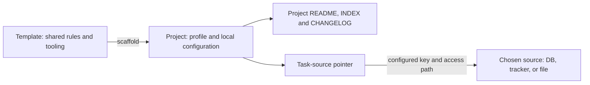
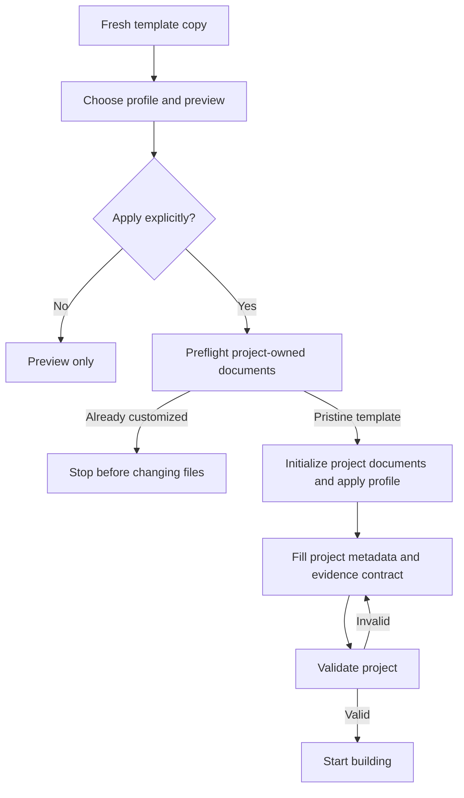

# AI Product Architecture Template

Governance and documentation template for AI product repositories. Provides a standardised structure for project documentation, security policies, contribution guidelines, and architectural decision records.

## What's Included

```
├── CLAUDE.md              # AI agent entry point — repo metadata, commands, quick reference
├── AGENTS.md              # Portable agent entry point — shared rules for Codex and other agents
├── CONTRIBUTING.md        # Setup, branch strategy, PR process, code style
├── SECURITY.md            # Vulnerability reporting, auth model, data protection
├── SYSTEM_PROMPT.md       # Shared operating policy (v3.2; runtime hierarchy still wins)
├── CHANGELOG.md           # Version history and release notes
├── docs/
    ├── 0_GROUND_RULES.md        # Stack, inviolable rules, protected files
    ├── 1_BUSINESS_CONTEXT.md    # Product, decision/evidence contract, vision, mission, markets
    ├── 2_ARCHITECTURE.md        # Routes, components, data model, directory structure
    ├── 3_UI_UX_GUIDELINES.md    # Design tokens, typography, spacing, UI rules
    ├── 5_ROADMAP_AND_TASKS.md   # Pointer to the project's authoritative task source
    ├── 6_CONTENT_AND_SOCIAL.md  # Content strategy + technical SEO/AEO/GEO (merged in v2.0)
    ├── 7_CONTENT_I18N.md        # Content architecture doctrine + i18n layer rules
    ├── 8_DATA_AND_ANALYSIS.md   # Product data, pipeline metrics, retention, data quality
    ├── 9_AGENT_SKILLS.md        # Agent Skills framework and structure
    ├── 10_AGENT_SAFETY.md       # Trust hierarchy, prompt injection policy, minimal privilege
    ├── 11_TESTING.md            # Testing strategy, framework selection, coverage, CI/CD gates, AI evals
    ├── 12_DEPENDENCY_MANAGEMENT.md  # Licence policy, SBOM, SLSA, upgrade strategy, CVE SLAs
    ├── 13_COMPLIANCE_FRAMEWORKS.md  # ISO/regulatory compliance directory (Tier 1-4)
    ├── 14_AI_GOVERNANCE.md      # EU AI Act, ISO 42001, NIST AI RMF, AI inventory
    ├── 15_HEALTH_CHECK.md       # Weekly health check checklist (renamed from 6_ in v2.0)
    ├── prompts.md                # Reusable generic prompt templates
    ├── guides/                   # Standalone how-to guides (git-crypt, Lovable vocabulary, ...)
    └── decisions/
        ├── TEMPLATE.md          # ODR (Organisational Decision Record) format
        └── template/            # ODRs inherited from this base template
├── scripts/
    ├── check-governance.mjs     # Dependency-free governance self-check
    ├── detect-ci-mode.mjs       # npm/Bun/Deno/Python stack detection used by CI
    ├── run-python-ci.py         # Python syntax and existing pytest suite
    └── scaffold.mjs             # Safe, dry-run-first profile scaffolder
└── tests/template/
    ├── fixtures/                # Executable npm, Bun, Deno and stdlib Python fixtures
    └── run-ci-fixtures.mjs      # Runs real install/check/test/audit paths
```

## How to Use

1. Click **"Use this template"** on GitHub (or clone and remove `.git`)
2. Run `node scripts/scaffold.mjs --list`, then preview a profile with `node scripts/scaffold.mjs --profile <name>`
3. Apply the selected profile explicitly with `node scripts/scaffold.mjs --profile <name> --apply`
4. Replace all remaining `[placeholders]` with your project-specific information
5. Run `node scripts/check-governance.mjs --project` to catch unfilled required placeholders and broken governance references
6. Start building

Applying a profile initializes a project-owned `INDEX.md` and a task-source
pointer. It does not copy this repository's initiatives, create a second
backlog, or connect the project to the maintainer's roadmap database. Choose
the project's real source (for example SQLite, an issue tracker, or a deliberate
local file), then record its key/filter and exact read/write path. Customize the
README and use the product's own release numbers in CHANGELOG; neither must
repeat the template's policy version.

### What belongs where?



The template owns the reusable rules. Each consumer owns its identity,
documentation and release history. Task state stays in the chosen source; the
Markdown file records how to reach it. If a project deliberately chooses a
local Markdown backlog, it can replace the pointer after that choice. A generated
view must identify its generator and the source where changes are authored.

### How initialization works



Repeat application of the same profile preserves subsequent project edits.
Scaffolding is for fresh copies; it is not an upgrade command for existing
projects.

These diagrams explain two distinct template behaviors. They are optional aids,
not diagrams that consumer repositories must reproduce.

### Validation modes

| Command | Contract |
|---|---|
| `node scripts/check-governance.mjs --template` | Template maintainer checks, including self-test fixtures and policy/release version coherence |
| `node scripts/check-governance.mjs --project` | Strict consumer metadata and product/evidence contract, with independent README and release history |
| `node scripts/check-governance.mjs` | Project mode when a profile manifest exists; otherwise legacy compatibility checks without forcing a migration |

An old consumer without a profile manifest is not the original template.
Migrate it by filling its metadata and evidence contract, then use `--project`
in its CI. Do not run `scaffold --apply` over a customized repository to obtain
a manifest. The template's own CI explicitly runs `--template`.

### Scaffold Profiles

| Profile | Use when |
|---|---|
| `minimal` | Small internal tool or prototype needing only the governance core |
| `react-supabase` | React/Supabase product with UI, product-data/evidence, content, i18n, and AI guidance |
| `python-data` | Python analytics, data science, or data-heavy AI product |
| `regulated-ai` | External or regulated AI product that needs the complete template |

The scaffolder is dry-run by default. It records intentional removals in
`template-profile.json`; switching profiles later requires starting from a fresh
copy because deleted modules cannot be reconstructed safely.

Python CI currently supports a root `requirements.txt` that directly declares
`pytest`, and runs `python -m pytest tests` after syntax checks with Python 3.12.
Other detected Python project setups fail with instructions to adapt the
workflow; the profile does not imply automatic support for every Python package
manager. Missing or empty test suites fail. No additional linter is installed.

## Design Principles

- **Opinionated for two stacks, not agnostic for all.** The product/evidence contract in doc 1 is stack-independent. `docs/8_DATA_AND_ANALYSIS.md` has separate interactive-product and batch/pipeline paths; `docs/2_ARCHITECTURE.md`, `docs/3_UI_UX_GUIDELINES.md`, and `docs/15_HEALTH_CHECK.md` still contain React/Vite + Tailwind + shadcn/ui + Supabase examples. Adapt examples rather than assuming the whole template is stack-neutral.
- **AI-first and multi-agent** — `AGENTS.md` carries portable guidance; runtime-specific adapters add capabilities without redefining the runtime's instruction hierarchy
- **Modular** — use what you need, delete what you don't
- **Convention over configuration** — consistent across all your repos
- **One source for task state** — INDEX stays a stable pointer map; task state lives in the declared database, tracker, code source, or deliberately chosen local file
- **Lean by default** — compliance/security machinery sized for a team (SBOM, SLSA, incident SLAs, AI eval suites) is opt-in, gated by `docs/13_COMPLIANCE_FRAMEWORKS.md` §Applicability Gate, not default weight every repo carries

## Author

**Gustavo Teixeira Cuco** — [GitHub](https://github.com/gtcuco-personal)

## License

[MIT](LICENSE)
